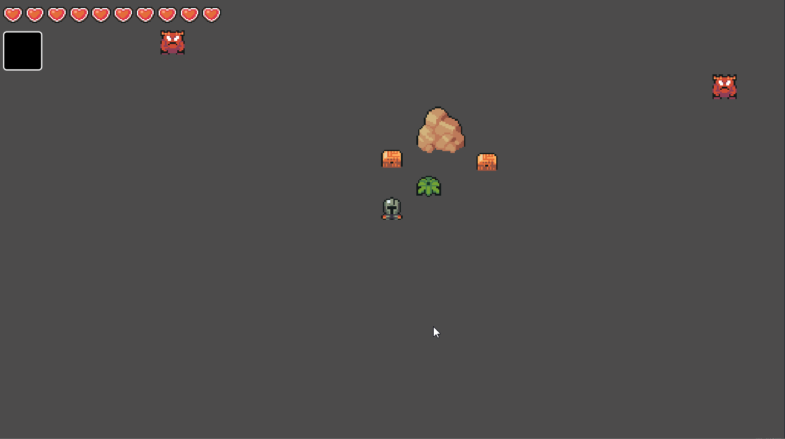

# Dim Spirits

A 2D Soulslike prototype I made to learn various concepts in Godot

## Features

- Movement
- Dodge Roll
- Player Attacks
  - Sword
  - Throwing Axe
  - Bombs
- Interactable Objects
- Inventory
- Destructible Environment
- Loot Drops
- Particle Effects, Camera Shake, Hit Stops
- Enemy AI with basic following and charge attack

## Gameplay

