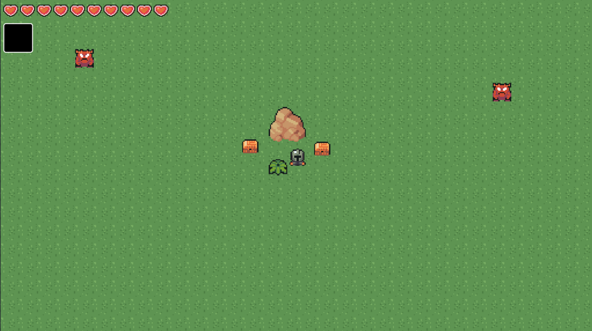

# Dim Spirits

This is a top-down 2D Soulslike prototype built with the Godot Engine.

## About

You play a knight with a sword, ten hearts, and no way to heal except what the world drops for you. Swinging the sword lunges you forward a little, so every attack commits you to a step you can't take back.

The dodge roll is pure movement, not an escape hatch. There are no invincibility frames in it, so rolling through an attack still costs you health. What it does give you is speed and distance, and you move nearly twice as fast as anything hunting you.

Taking a hit stops time for an instant, throws you backward, and shakes the screen. You're invincible while the knockback plays out, which is the only real breathing room the game gives you.

Beasts ignore you until you get close, then chase you down. When one gets in range it plants itself and winds up for two seconds before lunging at wherever you were standing when the windup ended, and it can't be hurt while winding up. That lunge hits for two hearts. Bait it, step aside, and punish the recovery. Each beast takes five damage to kill and waits five seconds before it can attack again.

Two items are hidden in chests, and you can only carry one equipped at a time:

| Item      | Behavior                                                                                                                           |
| --------- | ---------------------------------------------------------------------------------------------------------------------------------- |
| Bomb Bag  | Drops a bomb with a 1.5 second fuse. The blast deals three damage to anything nearby, including you. Two bombs can be live at once.  |
| Boomerang | Thrown in the direction you face. It stuns whatever it touches instead of damaging it, then curves back. Only one can be in flight.  |

The world breaks apart. Grass falls to a sword swing, an explosion, or a boomerang, and boulders only yield to a bomb. Beasts and grass drop loot about half the time, boulders always do, and hearts are the only thing that will patch you back up.

Chests open only when you are standing below one and facing up.

## Controls

| Action      | Input           |
| ----------- | --------------- |
| Move        | `W` `A` `S` `D` |
| Attack      | `J`             |
| Dodge Roll  | `Space`         |
| Use Item    | `K`             |
| Interact    | `E`             |
| Inventory   | `I`             |
| Select Item | `Left Click`    |

## Credits

### Programming

is386

### Art

UNKNOWN
